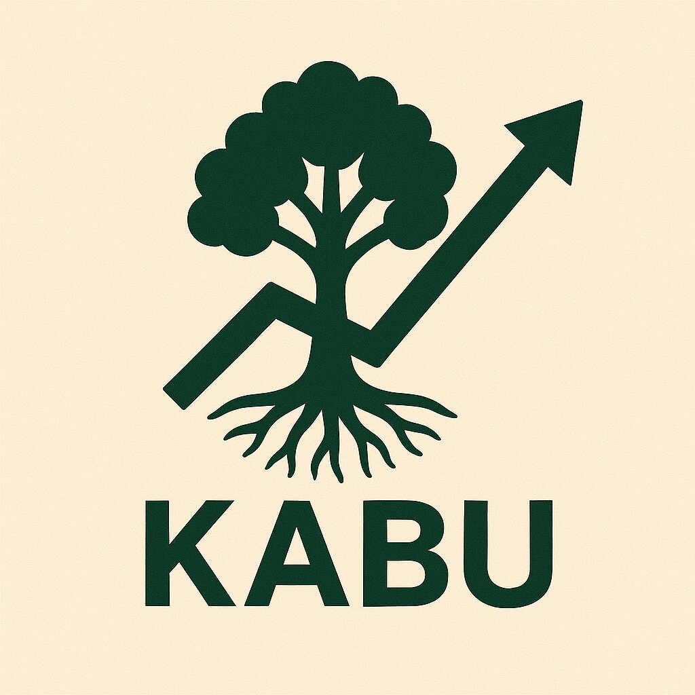

# Kabu

[][gh-kabu]
[][gh-book]
[![Telegram Chat][tg-badge]][tg-url]

| [User Book](https://cakevm.github.io/kabu/)
| [Crate Docs](https://cakevm.github.io/kabu/docs/) |

[gh-kabu]: https://github.com/cakevm/kabu/actions/workflows/ci.yml
[gh-book]: https://github.com/cakevm/kabu/actions/workflows/book.yml
[tg-badge]: https://img.shields.io/badge/telegram-kabu-2C5E3D?style=plastic&logo=telegram
[tg-url]: https://t.me/joinkabu

## What is Kabu?

Kabu is a backrunning bot, currently under heavy development. It continues the journey of [loom](https://github.com/dexloom/loom). Since then many breaking changes have been made to revm, reth and alloy. The goal here is to make everything work again and modernize the codebase. Currently, Kabu is a work in progress and not yet ready for production use.

## Who is Kabu for?

It is not intended to be a production-ready solution, but rather a playground for developers who want to learn about MEV and backrunning.

## Kabu is opinionated
- Kabu will only support exex and json-rpc.
- We reuse as much as possible from reth, alloy and revm
- We keep as close as possible to the architecture of reth

## Roadmap
- Remove `KabuDataTypes`
- Remove `Actor` model and use trait based components like in reth
- Remove topology and simplify the config / codebase
- Refactor the extra db pool cache layer to make it optional

## Kabu contract
Find the Kabu contract [here](https://github.com/cakevm/kabu-contract).

## Why "Kabu"?

In Japanese, *kabu* (株) means "stock" — both in the financial sense and as a metaphor for growth.  
The name symbolizes a system that is deeply rooted, yet highly responsive — growing upward like a market chart, grounded like a tree.

## Acknowledgements

Many thanks to [dexloom](https://github.com/dexloom)! This project is a hard-fork from [loom](https://github.com/dexloom/loom), based on this [branch](https://github.com/dexloom/loom/tree/entityid). The `flashbots` crate is fork of [ethers-flashbots](https://github.com/onbjerg/ethers-flashbots). The `uniswap-v3-math` crate is a fork of [uniswap-v3-math](https://github.com/0xKitsune/uniswap-v3-math). Additionally, some code for the Uniswap V3 pools is derived from [amms-rs](https://github.com/darkforestry/amms-rs). Last but not least, a big shoutout to [Paradigm](https://github.com/paradigmxyz) — without their work, this project would not have been possible.

## License
This project is licensed under the [Apache 2.0](./LICENSE-APACHE) or [MIT](./LICENSE-MIT). 