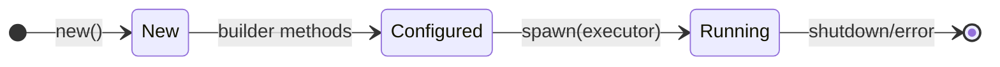

# Components

Components are the building blocks of Kabu's architecture. Each component is an independent processing unit that communicates with others through message passing.

## Component Trait

All components implement the `Component` trait:

```rust,ignore
pub trait Component: Send + Sync + 'static {
    fn spawn(self, executor: TaskExecutor) -> Result<()>;
    fn spawn_boxed(self: Box<Self>, executor: TaskExecutor) -> Result<()>;
    fn name(&self) -> &'static str;
}
```

## Component Lifecycle

<div align="center">



</div>

## Builder Pattern

Components use the builder pattern for configuration. Instead of manual channel wiring, components now use centralized `MevComponentChannels`:

```rust,ignore
pub struct MyComponent<DB> {
    config: MyConfig,
    channels: Option<MevComponentChannels<DB>>,
}

impl<DB> MyComponent<DB> {
    pub fn new(config: MyConfig) -> Self {
        Self {
            config,
            channels: None,
        }
    }
    
    pub fn with_channels(mut self, channels: &MevComponentChannels<DB>) -> Self {
        self.channels = Some(channels.clone());
        self
    }
}
```

## Core Components

### StateChangeArbSearcherComponent

Monitors state changes and identifies arbitrage opportunities:

```rust,ignore
StateChangeArbSearcherComponent::new(backrun_config)
    .with_channels(&channels)
    .with_market_state(market_state)
```

### SignersComponent  

Manages transaction signing with nonce tracking:

```rust,ignore
SignersComponent::<DB, KabuDataTypesEthereum>::new()
    .with_channels(&channels)
```

### FlashbotsBroadcastComponent

Submits transaction bundles to Flashbots:

```rust,ignore
FlashbotsBroadcastComponent::new(
    client.clone(),
    BroadcasterConfig::flashbots(signer),
)
.with_channels(&channels)
```

### PoolHealthMonitorComponent

Tracks pool reliability and removes unhealthy pools:

```rust,ignore
PoolHealthMonitorComponent::new()
    .with_channels(&channels)
    .with_market(market)
```

## Creating a Component

Here's a template for creating a new component:

```rust,ignore
use std::sync::Arc;
use tokio::sync::RwLock;
use eyre::{Result, eyre};
use kabu_core_components::{Component, MevComponentChannels};
use reth_tasks::TaskExecutor;

pub struct MyComponent<DB: Clone + Send + Sync + 'static> {
    config: MyConfig,
    channels: Option<MevComponentChannels<DB>>,
}

impl<DB> MyComponent<DB> {
    pub fn new(config: MyConfig) -> Self {
        Self {
            config,
            channels: None,
        }
    }
    
    pub fn with_channels(mut self, channels: &MevComponentChannels<DB>) -> Self {
        self.channels = Some(channels.clone());
        self
    }
}

impl<DB> Component for MyComponent<DB> 
where
    DB: DatabaseRef + Send + Sync + Clone + 'static,
{
    fn spawn(self, executor: TaskExecutor) -> Result<()> {
        let name = self.name();
        let channels = self.channels.ok_or_else(|| eyre!("channels not set"))?;
        
        // Subscribe to relevant channels
        let mut market_events = channels.market_events.subscribe();
        
        executor.spawn_critical(name, async move {
            info!("Starting {}", name);
            
            while let Ok(event) = market_events.recv().await {
                // Process events
                match event {
                    MarketEvents::BlockHeaderUpdate { .. } => {
                        // Handle block update
                    }
                    _ => {}
                }
            }
            
            info!("{} shutting down", name);
        });
        
        Ok(())
    }
    
    fn spawn_boxed(self: Box<Self>, executor: TaskExecutor) -> Result<()> {
        (*self).spawn(executor)
    }
    
    fn name(&self) -> &'static str {
        "MyComponent"
    }
}
```

## Component Communication

Components communicate through typed channels in `MevComponentChannels`:

### Event Types

- **MarketEvents**: Block headers, state updates, pool updates
- **MempoolEvents**: New transactions, transaction updates
- **SwapComposeMessage**: Swap preparation, routing, execution
- **HealthEvent**: Pool errors, component health

### Example: Processing Swaps

```rust,ignore
// In your component
let mut swap_compose = channels.swap_compose.subscribe();

while let Ok(msg) = swap_compose.recv().await {
    match msg.inner {
        SwapComposeMessage::Prepare(data) => {
            // Prepare swap for execution
            let estimated = estimate_swap(data).await?;
            channels.estimated_swaps.send(estimated)?;
        }
        SwapComposeMessage::Ready(data) => {
            // Swap is ready for broadcast
        }
        _ => {}
    }
}
```

## Best Practices

1. **Channel Management**
   - Always use `MevComponentChannels` for communication
   - Handle `RecvError::Closed` gracefully for shutdown
   - Use bounded channels to prevent memory issues

2. **Error Handling**
   ```rust,ignore
   match rx.recv().await {
       Ok(msg) => process(msg),
       Err(RecvError::Closed) => {
           debug!("{} channel closed, shutting down", name);
           break;
       }
       Err(RecvError::Lagged(n)) => {
           warn!("{} lagged by {} messages", name, n);
           continue;
       }
   }
   ```

3. **State Access**
   - Minimize lock duration
   - Use read locks when possible
   - Clone data out of locks for processing

4. **Lifecycle**
   - Components should be stateless when possible
   - Use `spawn_critical` for essential components
   - Log startup and shutdown

5. **Testing**
   - Test component logic separately from messaging
   - Use mock channels for unit tests
   - Integration test with real channels